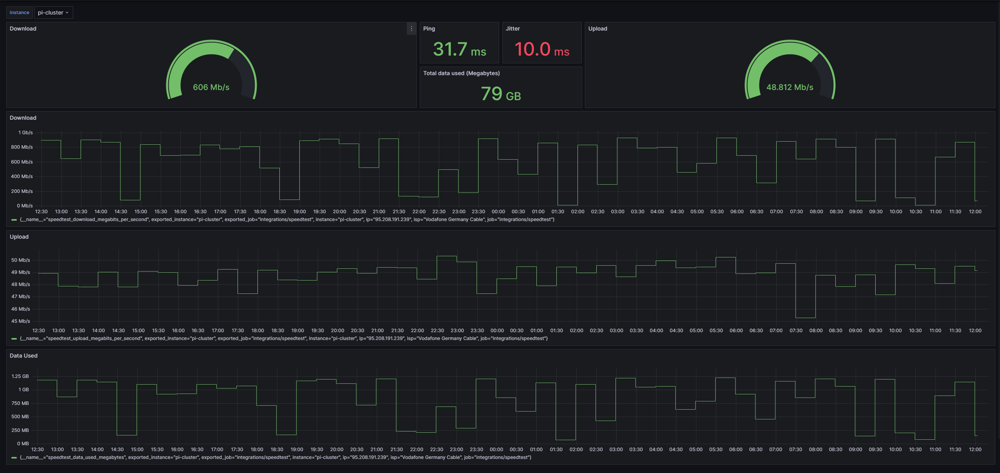

[](https://github.com/heathcliff26/speedtest-exporter/actions/workflows/ci.yaml)
[](https://coveralls.io/github/heathcliff26/speedtest-exporter)
[](https://github.com/heathcliff26/speedtest-exporter/actions/workflows/editorconfig-check.yaml)
[](https://github.com/heathcliff26/speedtest-exporter/actions/workflows/go-testcover-report.yaml)
[](https://github.com/heathcliff26/speedtest-exporter/actions/workflows/renovate.yaml)

# speedtest-exporter

This project is a prometheus exporter for speedtests implemented in go.
It runs automatically speedtests with the speedtest.net API and exports the result as prometheus metrics.
It supports native speedtest by using [speedtest-go](https://github.com/showwin/speedtest-go).

I created this project because i saw [Jeff Geerling's](https://github.com/geerlingguy) video about his speedtest setup.
When looking into it, he uses a [python based speedtest-exporter](https://github.com/MiguelNdeCarvalho/speedtest-exporter).
At this point i could have just used that as well, but i was bored and wanted to program something. Hence this project.

One important functionality is that this projects implements prometheus remote_write, so it can push the metrics directly to e.g. grafana cloud.

## Table of Contents

- [speedtest-exporter](#speedtest-exporter)
  - [Table of Contents](#table-of-contents)
  - [Container Images](#container-images)
    - [Image location](#image-location)
    - [Tags](#tags)
  - [Usage](#usage)
  - [Configuration](#configuration)
  - [Metrics](#metrics)
  - [Dashboard](#dashboard)

## Container Images

### Image location

| Container Registry                                                                                      | Image                                       |
| ------------------------------------------------------------------------------------------------------- | ------------------------------------------- |
| [Github Container](https://github.com/users/heathcliff26/packages/container/package/speedtest-exporter) | `ghcr.io/heathcliff26/speedtest-exporter`   |
| [Docker Hub](https://hub.docker.com/repository/docker/heathcliff26/speedtest-exporter)                  | `docker.io/heathcliff26/speedtest-exporter` |

### Tags

There are different flavors of the image:

| Tag(s)     | Description                                                                                                                 |
| ---------- | --------------------------------------------------------------------------------------------------------------------------- |
| **latest** | Last released slim version of the image.                                                                                    |
| **slim**   | Contains only the speedtest-exporter binary and uses native golang implementation.                                          |
| **cli**    | Alpine based container that also contains the speedtest.net cli client binary. Uses the speedtest.net cli to run the tests. |
| **vX.Y.Z** | Released version of the image.                                                                                              |

## Usage

To run the image with default settings simply use:
```
podman run -d -p 8080:8080 ghcr.io/heathcliff26/speedtest-exporter:slim
```
You can then view you metrics under `http://localhost:8080/metrics`

## Configuration

Output of `speedtest-exporter -h`
```
Usage of speedtest-exporter:
  -config string
        Optional: Path to config file
  -env
        Used together with -config, when set will expand enviroment variables in config
  -version
        Show the version information and exit
```
An example configuration can be found [here](configs/example-config.yaml).

## Metrics

The following metrics are exported:

| Metric                                   | Description                                |
| ---------------------------------------- | ------------------------------------------ |
| `speedtest_jitter_latency_milliseconds`  | Speedtest current Jitter in ms             |
| `speedtest_ping_latency_milliseconds`    | Speedtest current Ping in ms               |
| `speedtest_download_megabits_per_second` | Speedtest current Download Speed in Mbit/s |
| `speedtest_upload_megabits_per_second`   | Speedtest current Upload Speed in Mbit/s   |
| `speedtest_data_used_megabytes`          | Data used for speedtest in MB              |
| `speedtest_up`                           | Indicates if the speedtest was successful  |

## Dashboard

A ready made dashboard for the exporter can be imported from json. The json file can be found [here](dashboard/dashboard.json).

The dashboard is also published on grafana.com with the id [20115](https://grafana.com/grafana/dashboards/20115).

Here is a preview of the dashboard:

